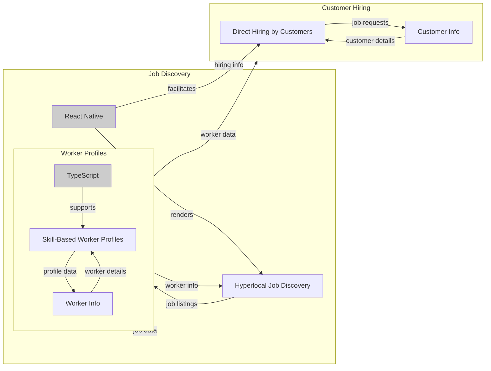

# Rozgar_Connect
[](https://github.com/user/Rozgar_Connect/blob/main/LICENSE) [](https://www.typescriptlang.org/) [](https://github.com/user/Rozgar_Connect) [](https://github.com/user/Rozgar_Connect/stargazers)

> **RozgarConnect is a breakthrough platform to digitally transform how India finds, hires and mobilizes local talent.**

## Why Rozgar_Connect Exists
Rozgar_Connect is built for the people who need it the most - the blue-collar workers, households, small businesses, and NGOs who struggle to find reliable and efficient ways to connect with each other. We believe that by providing a platform that bridges this gap, we can create a more equitable and accessible job market. Our primary users are skilled and semi-skilled workers such as plumbers, electricians, mechanics, drivers, cleaners, carpenters, and helpers who need consistent local earning opportunities without relying on middlemen.

The current state of the job market is fragmented, with many workers relying on word of mouth or intermediaries to find work. This leads to inefficiencies, wasted time, and lost opportunities. Rozgar_Connect aims to change this by providing a platform that allows workers to find nearby job opportunities based on their skills and location, enabling faster hiring and reducing travel time. Our platform also caters to households and customers who need reliable help for everyday services like repairs, maintenance, cleaning, or assistance at home.

By targeting the root causes of these problems, Rozgar_Connect has the potential to make a significant impact on the lives of millions of people. We envision a future where workers can find consistent and well-paying work, customers can find reliable and skilled workers, and small businesses can thrive by accessing a pool of talented and dedicated workers. This is why Rozgar_Connect exists - to create a better future for everyone involved.

## ✨ Features
**1. Hyperlocal Job Discovery** — Workers can find nearby job opportunities based on their skills and location, enabling faster hiring and reducing travel time. This feature uses geolocation technology to match workers with job postings in their area, making it easier for them to find work and for customers to find the right person for the job.

**2. Skill-Based Worker Profiles** — Job Finders create simple profiles showcasing their skills, experience, and availability, making it easy for customers and vendors to identify suitable workers. This feature allows workers to showcase their strengths and qualifications, increasing their visibility and chances of getting hired.

**3. Direct Hiring by Customers** — Customers can search for services like plumbing, electrical work, cleaning, driving, etc., and directly contact nearby workers for immediate assistance. This feature streamlines the hiring process, reducing the time and effort required to find the right person for the job.

**4. Job Posting Management** — Customers and vendors can manage their job postings and worker applications through the app's dashboard, making it easier to track and manage their workforce. This feature provides a centralized platform for managing job postings, applications, and worker assignments, reducing administrative burdens and increasing efficiency.

## 🏗️ Architecture
The Rozgar_Connect system is designed as a mobile app, built using React Native and TypeScript. The app's architecture is divided into several layers, each playing a crucial role in the overall functionality of the platform.

### Frontend
**React Native** is used to build the mobile app's user interface and user experience. React Native provides a flexible and efficient way to build cross-platform apps, allowing us to target both Android and iOS devices.

### Backend
**Node.js** is used as the backend framework, providing a robust and scalable foundation for the app's server-side logic. Node.js enables us to build a fast and efficient backend, capable of handling a large volume of requests and data.

### Database
Although no database is currently detected, we plan to integrate a database management system in the future to store and manage user data, job postings, and other relevant information.

### Auth
No authentication system is currently implemented, but we plan to integrate an authentication framework in the future to provide secure and personalized access to the app's features.



## 📑 Table of Contents
* [Rozgar_Connect](#rozgar_connect)
* [Why Rozgar_Connect Exists](#why-rozgar_connect-exists)
* [✨ Features](#-features)
* [🏗️ Architecture](#-architecture)
* [📑 Table of Contents](#-table-of-contents)
* [🚀 Quick Start](#-quick-start)
* [⚙️ Configuration](#-configuration)
* [📖 Usage](#-usage)
* [🤝 Contributing](#-contributing)
* [📄 License](#-license)

## 🚀 Quick Start
To get started with Rozgar_Connect, follow these steps:
* Prerequisites:
  * Node.js 18+
  * npm 9+
  * React Native CLI 0.1+
* Installation:
  ```bash
  git clone https://github.com/user/Rozgar_Connect.git
  ```
  ```bash
  cd Rozgar_Connect
  ```
  ```bash
  npm install
  ```
  ```bash
  cp .env.example .env.local
  ```
  ```bash
  npm run start
  ```

## ⚙️ Configuration
Although no environment variables are provided, we recommend creating a `.env` file to store sensitive information and configuration settings. To create a `.env` file, run the following command:
```bash
cp .env.example .env.local
```
This will create a copy of the `.env.example` file, which you can then modify to suit your needs.

| Variable | Description |
| --- | --- |
| `REACT_NATIVE_ENV` | The environment variable for React Native |
| `NODE_ENV` | The environment variable for Node.js |

## 📖 Usage
To use Rozgar_Connect, follow these steps:
1. Open the Rozgar_Connect mobile app on your device
2. Browse through the hyperlocal job listings to find a job that matches your skills
3. Create a skill-based worker profile to showcase your expertise
4. Apply for a job that you're interested in
5. If you're a customer, use the direct hiring feature to connect with workers who have the skills you need
6. Manage your job postings and worker applications through the app's dashboard

## 🤝 Contributing
We welcome contributions from the open-source community. To contribute to Rozgar_Connect, follow these steps:
* Fork the repository
* Clone the repository
* Create a new branch for your feature or bug fix
* Commit your changes and push them to the remote repository
* Submit a pull request
* Please follow our code style guidelines and include a detailed description of your changes in your pull request.

Special thanks to our top contributor, **akritithap07**, for their valuable contributions to the project.

## 📄 License
Rozgar_Connect is licensed under the [Apache 2.0 license](https://github.com/user/Rozgar_Connect/blob/main/LICENSE).