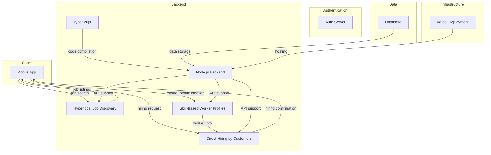

# Rozgar_Connect
[](https://github.com/user/Rozgar_Connect/blob/main/LICENSE) [](https://www.typescriptlang.org/) [](https://github.com/user/Rozgar_Connect) [](https://github.com/user/Rozgar_Connect/stargazers)

> **RozgarConnect is a breakthrough platform to digitally transform how India finds, hires and mobilizes local talent.**

## Why Rozgar_Connect Exists
Rozgar_Connect is built for the people who need it the most - blue-collar workers, households, small businesses, and NGOs. The current system of finding and hiring local talent is broken, with many workers relying on middlemen to find jobs, and customers struggling to find reliable help. Rozgar_Connect aims to bridge this gap by providing a platform for workers to showcase their skills and find job opportunities, and for customers to find and hire workers directly.

The problem of finding and hiring local talent is a complex one, with many stakeholders involved. Blue-collar workers, such as plumbers, electricians, and mechanics, often struggle to find consistent work, and may have to rely on middlemen to find jobs. Households and customers, on the other hand, may struggle to find reliable help for everyday services like repairs, maintenance, and cleaning. Small businesses and vendors may need temporary or short-term workers to complete tasks quickly, but may not know where to find them. NGOs and community organizations may require volunteers or skilled individuals for community drives, social initiatives, or emergency response.

Rozgar_Connect is built to address these problems, by providing a platform for workers to create profiles showcasing their skills and experience, and for customers to search for and hire workers directly. By cutting out the middlemen and providing a direct connection between workers and customers, Rozgar_Connect aims to make it easier for workers to find job opportunities, and for customers to find reliable help.

## ✨ Features
**1. Hyperlocal Job Discovery** — Workers can find nearby job opportunities based on their skills and location, enabling faster hiring and reducing travel time. This feature uses geolocation technology to match workers with job opportunities in their local area, making it easier for them to find work and for customers to find reliable help.

**2. Skill-Based Worker Profiles** — Job Finders create simple profiles showcasing their skills, experience, and availability, making it easy for customers and vendors to identify suitable workers. This feature allows workers to showcase their skills and experience, and for customers to search for workers based on their specific needs.

**3. Direct Hiring by Customers** — Customers can search for services like plumbing, electrical work, cleaning, driving, etc., and directly contact nearby workers for immediate assistance. This feature allows customers to find and hire workers directly, cutting out the middlemen and making it easier for them to find reliable help.

**4. Worker Profile Management** — Workers can manage their profiles, including updating their skills, experience, and availability. This feature allows workers to take control of their profiles, and to make sure that their information is up-to-date and accurate.

## 🏗️ Architecture
The Rozgar_Connect system is designed as a mobile app, with a backend built using Node.js and a frontend built using TypeScript. The system uses a simple and intuitive architecture, with a focus on ease of use and scalability.

### Frontend
The frontend of the Rozgar_Connect system is built using **TypeScript**, and provides a simple and intuitive interface for workers and customers to interact with the system.

### Backend
The backend of the Rozgar_Connect system is built using **Node.js**, and provides a robust and scalable platform for the system to operate on.

### Deployment
The Rozgar_Connect system is deployed using **Vercel**, which provides a fast and reliable platform for the system to be hosted on.



## 📑 Table of Contents
* [Introduction](#rozgar_connect)
* [Why Rozgar_Connect Exists](#why-rozgar_connect-exists)
* [Features](#-features)
* [Architecture](#-architecture)
* [Table of Contents](#-table-of-contents)
* [Quick Start](#-quick-start)
* [Configuration](#-configuration)
* [Usage](#-usage)
* [Contributing](#-contributing)
* [License](#-license)

## 🚀 Quick Start
To get started with Rozgar_Connect, you will need to have the following prerequisites installed:
* Node.js 18+
* TypeScript 4.8+
* npm 9+

To install Rozgar_Connect, follow these steps:
```bash
git clone https://github.com/user/Rozgar_Connect.git
```
```bash
cd Rozgar_Connect
```
```bash
npm install
```
```bash
cp .env.example .env.local
```
```bash
npm run start
```

## ⚙️ Configuration
To configure Rozgar_Connect, you will need to create a `.env` file with the following variables:
| Variable | Description |
| --- | --- |
| `NODE_ENV` | The environment to run the system in (e.g. `development`, `production`) |
| `PORT` | The port to run the system on (e.g. `3000`) |
| `DB_HOST` | The host of the database (e.g. `localhost`) |
| `DB_PORT` | The port of the database (e.g. `5432`) |
| `DB_USER` | The username to use to connect to the database (e.g. `username`) |
| `DB_PASSWORD` | The password to use to connect to the database (e.g. `password`) |

To create a `.env` file, run the following command:
```bash
cp .env.example .env.local
```
Then, update the variables in the `.env` file to match your system's configuration.

## 📖 Usage
To use Rozgar_Connect, follow these steps:
1. Open `http://localhost:3000` in your browser to access the Rozgar_Connect mobile app web interface.
2. Click on the **Discover Jobs** tab to explore hyperlocal job listings.
3. Create a worker profile by clicking on the **Create Profile** button and filling in your skills and experience.
4. As a customer, click on the **Hire Workers** tab to find and directly hire workers based on their skills and profiles.
5. Use the search bar to find jobs or workers in your local area.

## 🤝 Contributing
To contribute to Rozgar_Connect, follow these steps:
1. Fork the Rozgar_Connect repository on GitHub.
2. Clone the repository to your local machine.
3. Create a new branch for your changes (e.g. `feature/new-feature`).
4. Make your changes and commit them to your branch.
5. Push your branch to GitHub and submit a pull request.
6. Make sure to follow the code style guidelines and include a PR template.

Special thanks to our top contributor, **akritithap07**, for their hard work and dedication to the project.

## 📄 License
Rozgar_Connect is licensed under the **Apache 2.0** license. See the [LICENSE](https://github.com/user/Rozgar_Connect/blob/main/LICENSE) file for more information.