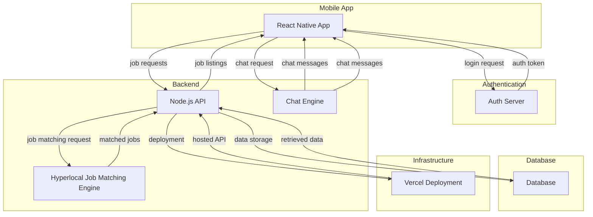

# Architecture Diagram

Generated by [IntentMesh](https://intentmesh.vercel.app)

```mermaid
flowchart TD
  subgraph SG_CLIENT["Mobile App"]
    MOBILE_APP["React Native App"]
  end
  subgraph SG_AUTH["Authentication"]
    AUTH_SERVER["Auth Server"]
  end
  subgraph SG_APP["Backend"]
    API_SERVER["Node.js API"]
    JOB_MATCH["Hyperlocal Job Matching Engine"]
    CHAT_ENGINE["Chat Engine"]
  end
  subgraph SG_DATA["Database"]
    DATABASE["Database"]
  end
  subgraph SG_INFRA["Infrastructure"]
    DEPLOYMENT["Vercel Deployment"]
  end
  MOBILE_APP -->|"job requests"| API_SERVER
  API_SERVER -->|"job listings"| MOBILE_APP
  API_SERVER -->|"job matching request"| JOB_MATCH
  JOB_MATCH -->|"matched jobs"| API_SERVER
  MOBILE_APP -->|"chat request"| CHAT_ENGINE
  CHAT_ENGINE -->|"chat messages"| MOBILE_APP
  CHAT_ENGINE -->|"chat messages"| MOBILE_APP
  API_SERVER -->|"data storage"| DATABASE
  DATABASE -->|"retrieved data"| API_SERVER
  API_SERVER -->|"deployment"| DEPLOYMENT
  DEPLOYMENT -->|"hosted API"| API_SERVER
  AUTH_SERVER -->|"auth token"| MOBILE_APP
  MOBILE_APP -->|"login request"| AUTH_SERVER
  class MOBILE_APP,API_SERVER,JOB_MATCH,CHAT_ENGINE,AUTH_SERVER,DATABASE,DEPLOYMENT SG_CLIENT,SG_APP,SG_AUTH,SG_DATA,SG_INFRA
```
